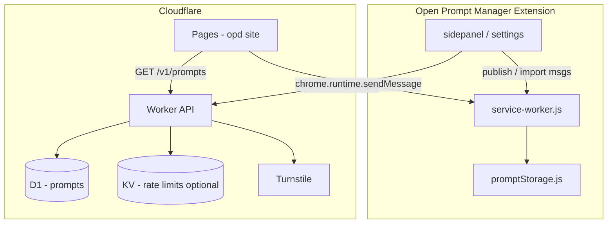

# Open Prompt Database (OPD) — Engineering Plan

Living notes for the community prompt catalog: publish from the extension, browse on the web, import back into Open Prompt Manager. Last drafted **May 2026** (targets **OPM v2.8+**).

**Related:** `plan.md` (core extension debt), `src/storage/promptStorage.js` (import/export), `src/sidepanel/styles.css` (visual system).

**Explicitly not:** private cloud sync, per-website libraries, or changes to LLM API keys / provider endpoints.

---

## Product Summary

| Surface | User action | Outcome |
|---------|-------------|---------|
| **Extension** | “Publish to Open Prompt Database” on a prompt | Public catalog entry under `@username` |
| **Website** | Browse / search / open detail | Read community prompts |
| **Website** | “Add to Open Prompt Manager” | Merges one prompt into local library via extension |
| **Settings** | Set display username + enable OPD | Required before first publish |

Community content is **unverified**. Authors are display names only until a later auth phase.

---

## Design System (match side panel + settings)

Reuse existing tokens and layout patterns — do **not** invent a separate brand for v1.

### CSS tokens (from `sidepanel/styles.css`)

| Token | Value | Usage |
|-------|-------|-------|
| `--primary` | `#3674b5` | Headings, buttons, links, tag chips |
| `--hover-primary` | `#4b93e0` | Button hover |
| `--light-bg` | `#F7FAFC` | Page / panel background |
| `--input-light-border` | `1px solid #CBD5E0` | Text fields |
| `--input-light-bg` | `#FFFFFF` | Inputs |
| `--input-light-text` | `#2D3748` | Body text |

Dark mode: follow `prefers-color-scheme: dark` + `forceDarkMode` parity where the site is extension-adjacent (settings link opens site with `?theme=dark` optional later).

### Shared layout primitives

| Class / pattern | Where used | Notes |
|-----------------|------------|-------|
| `.title` + `h2` + 22px icon | Extension settings, side panel, **OPD site header** | Same header row as `settings.html` / `sidepanel/index.html` |
| `.settings-section` + `.settings-heading` + `.pm-subtitle` | OPD settings block in extension | Copy structure from `settings.html` |
| `.prompt-list-controls` + `.prompt-search-input` | OPD browse page | Mirror side panel search |
| `.prompt-tags-filter` + tag chips | OPD browse + detail | Same chip styling as in-page / side panel |
| `#prompt-list li` card style | OPD list rows | Title, tags, author, date — compact row |
| `.info-banner` | First-run / publish confirm / import success | Same as side panel banners |
| `button.main` | Primary CTAs | Publish, Import, Save username |
| `.settings-community-link` | Footer on OPD site | GitHub, extension CWS link |

### Typography & spacing

- Font stack: `Helvetica, Verdana, Geneva, Tahoma, sans-serif` (side panel default).
- Section gap: `settings-section` margins (already in `styles.css`).
- Min touch width: 286px side panel minimum → OPD mobile breakpoint `min-width: 286px` for parity.

---

## Architecture Overview



| Component | Tech | Responsibility |
|-----------|------|----------------|
| `opd-api` | Cloudflare Worker | REST: list, get, publish, report |
| `opd-db` | D1 | `prompts`, `reports` tables |
| `opd-web` | Pages (or Worker static) | Browse UI, detail, legal pages |
| `src/opd/` (new) | Extension modules | Client, settings, UI hooks |
| `service-worker.js` | Existing | `externally_connectable`, message router |
| `promptStorage.js` | Existing | `importPublicPrompt()` wrapper |

---

## Public Data Model

### Catalog prompt (published shape)

Only fields safe to expose. **Never** upload full v2 backup (`folders`, `meta.tagsOrder`, local uuids as stable public ids optional).

```json
{
  "id": "550e8400-e29b-41d4-a716-446655440000",
  "title": "Polite follow-up email",
  "content": "Write a short follow-up email to #recipient# about #topic#.",
  "tags": ["work", "email"],
  "author": "jbertholet",
  "publishedAt": "2026-05-25T12:00:00.000Z",
  "updatedAt": null,
  "stats": { "imports": 0 }
}
```

### Validation limits (API + extension before POST)

| Field | Max | Rules |
|-------|-----|-------|
| `title` | 200 chars | Trim, no HTML |
| `content` | 32 KB | Plain text; reject `</script`, `javascript:` |
| `tags` | 10 tags × 32 chars | Lowercase normalized server-side |
| `author` | 3–32 chars | `[a-z0-9_-]` only; set in settings |

### Extension-only storage keys

| Key | Type | Purpose |
|-----|------|---------|
| `opdEnabled` | boolean | User opted in; gates host permission |
| `opdUsername` | string | Display author handle |
| `opdPublishToken` | string (uuid) | Per-install secret sent on publish |
| `opdApiBaseUrl` | string | Default prod URL; override for staging |

---

## API Sketch (v1)

Base: `https://openpromptdatabase.com/v1`.

| Method | Path | Auth | Description |
|--------|------|------|-------------|
| `GET` | `/prompts` | — | List: `?q=&tag=&author=&cursor=&limit=20` |
| `GET` | `/prompts/:id` | — | Single prompt |
| `POST` | `/prompts` | `X-OPD-Token` + Turnstile | Create / update own prompt by id |
| `POST` | `/prompts/:id/report` | — | Abuse report (reason enum) |
| `DELETE` | `/prompts/:id` | `X-OPD-Token` | Soft-delete (MVP: admin-only ok) |

**Rate limits (KV counters):** 10 publishes / hour / token; 120 reads / min / IP.

**CORS:** Allow `chrome-extension://<extension-id>` and OPD web origin only.

---

## Extension UX Plan

### 1. Settings — new section (after “Prompt management”)

File: `src/settings.html` + `settings.js`

```html
<section class="settings-section" id="opd-settings-section">
  <h3 class="settings-heading">Open Prompt Database</h3>
  <p class="pm-subtitle">Share prompts with the community or browse imports on the web.</p>
  <label class="settings-toggle-row">
    <span>Enable Open Prompt Database</span>
    <input type="checkbox" id="toggle-opd-enabled" class="settings-toggle-input">
    <span class="settings-toggle-switch" aria-hidden="true"></span>
  </label>
  <label class="settings-field-label" for="opd-username">Username</label>
  <input type="text" id="opd-username" class="opm-input-field" placeholder="your_handle" maxlength="32" />
  <p class="pm-subtitle settings-shortcut-hint">Letters, numbers, underscore, hyphen. Shown as @username on published prompts.</p>
  <a class="settings-community-link" id="opd-browse-link" href="#" target="_blank" rel="noopener noreferrer">
    
    <span>Browse Open Prompt Database</span>
  </a>
</section>
```

- On enable: request optional host permission `https://api.<domain>/*` (or use `permissions.request` at first publish).
- Generate `opdPublishToken` on first enable; persist in `chrome.storage.local`.

### 2. Side panel — prompt actions

File: `src/sidepanel/sidepanel.js` + `index.html`

- On prompt **edit** view or row context menu: **“Publish…”** (icon: share / `open_in_new.svg`).
- Flow:
  1. If `!opdEnabled` or `!opdUsername` → toast + link to settings.
  2. `.info-banner` confirm: title preview, reminder to remove secrets.
  3. `POST` via service worker → success shows link “View on database”.
- Optional badge on list item: small “published” dot if `prompt.opdPublicId` stored locally (extension-only field, not in export backup by default).

### 3. Service worker — message types

File: `src/service-worker.js`

| Message `type` | Payload | Handler |
|----------------|---------|---------|
| `OPD_PUBLISH_PROMPT` | `{ title, content, tags, localUuid }` | Validate → API POST → return `{ id, url }` |
| `OPD_IMPORT_PROMPT` | `{ prompt }` | `mergePrompts([prompt])` → `{ ok, uuid }` |
| `OPD_FETCH_STATUS` | — | Return enabled, username, api health |

**Manifest additions** (`manifest.json`):

```json
"externally_connectable": {
  "matches": ["https://openpromptdatabase.com/*"]
},
"optional_host_permissions": [
  "https://openpromptdatabase.com/*"
]
```

### 4. New module layout

```
src/
├── opd/
│   ├── opdClient.js       # fetch wrapper, errors, staging base URL
│   ├── opdPublish.js      # map local prompt → public schema
│   └── opdImport.js       # map public prompt → normalisePrompt input
├── storage/
│   └── promptStorage.js   # + importPublicPrompt() if needed
```

`opdClient.js` must **not** embed or modify LLM API keys or provider URLs.

---

## Website UX Plan (OPD)

Host: `https://openpromptdatabase.com` (Cloudflare Worker + static assets). **Reuse** `sidepanel/styles.css` (copy or symlink into `opd/public/assets/`).

### Pages

| Route | Layout | Components |
|-------|--------|------------|
| `/` | `.title` + search + tag filter + list | `#prompt-list` style cards, pagination |
| `/p/:id` | Detail | Title, author `@name`, tags, `<pre>` content, **Add to OPM** |
| `/u/:author` | Author listing | Filter by author |
| `/about` | Static | ToS, privacy, moderation |
| `/import` | Fallback | “Install extension” + manual JSON paste (phase 2) |

### Detail page — import CTA

```html
<button type="button" class="main" id="opd-import-btn">Add to Open Prompt Manager</button>
<p id="opd-import-status" class="pm-subtitle settings-status" aria-live="polite"></p>
```

**Happy path (extension installed):**

```js
chrome.runtime.sendMessage(
  OPM_EXTENSION_ID,
  { type: 'OPD_IMPORT_PROMPT', prompt: catalogPrompt },
  (res) => { /* show success / install extension */ }
);
```

**Fallback:** detect `chrome.runtime` missing → CWS link + copy JSON button.

### Browse list row (mirror side panel)

- Title (primary color, 14–15px semibold).
- Tag chips row (`.prompt-tags-filter` chip styles).
- Meta line: `@author` · relative date · import count.
- Click row → `/p/:id`.

---

## Security & Abuse (required for launch)

| Area | MVP requirement |
|------|-----------------|
| Input validation | Server-side schema; strip HTML; length caps |
| Publish auth | `X-OPD-Token` per install (not username alone) |
| Bots | Cloudflare Turnstile on `POST /prompts` |
| Rate limits | Per token + per IP on write |
| XSS | Escape all user text on site; `Content-Type: application/json` API |
| Prompt injection | Import preview in extension before merge (phase 1.5) |
| Secrets | Publish confirmation copy; block patterns like `sk-`, `api_key=` (heuristic, warn only) |
| Reports | `POST .../report` + manual review queue |
| Legal | ToS: user grants license to display; takedown contact |
| Privacy | No email required MVP; no full backup uploads |

**Out of scope MVP:** OAuth accounts, E2E encryption, automated ML moderation.

---

## Implementation Phases

### Phase 0: Foundation (HIGH) — ~2–3 days

- [ ] Register domain + Cloudflare zone
- [ ] Create D1 schema + Worker `opd-api` skeleton
- [ ] Deploy staging API + `opdApiBaseUrl` in extension dev builds
- [ ] Add `src/opd/opdClient.js` with typed errors
- [ ] Document `OPM_EXTENSION_ID` constant for website build

**D1 schema:**

```sql
CREATE TABLE prompts (
  id TEXT PRIMARY KEY,
  title TEXT NOT NULL,
  content TEXT NOT NULL,
  tags TEXT NOT NULL, -- JSON array
  author TEXT NOT NULL,
  publish_token_hash TEXT NOT NULL,
  published_at TEXT NOT NULL,
  updated_at TEXT,
  deleted_at TEXT
);
CREATE INDEX idx_prompts_author ON prompts(author);
CREATE INDEX idx_prompts_published ON prompts(published_at DESC);
```

### Phase 1: Read-only catalog (HIGH) — ~2–3 days

Prove browse + import before write path.

- [ ] `GET /prompts`, `GET /prompts/:id`
- [ ] OPD Pages: `/`, `/p/:id` with side panel CSS
- [ ] Seed 10–20 prompts via script
- [ ] `externally_connectable` + `OPD_IMPORT_PROMPT` in service worker
- [ ] Website “Add to OPM” button + install fallback
- [ ] `promptStorage.mergePrompts` path tested with catalog shape

### Phase 2: Publish from extension (HIGH) — ~2–3 days

- [ ] Settings section: enable, username, browse link
- [ ] Side panel “Publish…” + confirm banner
- [ ] `POST /prompts` + Turnstile widget token from extension (webview or offscreen — evaluate simplest path)
- [ ] Store `opdPublicId` on local prompt optional metadata
- [ ] Success toast + link to public URL

### Phase 3: Search, tags, polish (MEDIUM) — ~2 days

- [ ] Tag filter chips on website (client-side or `?tag=`)
- [ ] Search debounce (mirror `prompt-search-input` behaviour)
- [ ] Author page `/u/:author`
- [ ] `info-banner` first visit on site (“Community prompts are unverified”)
- [ ] Dark mode CSS pass on OPD pages

### Phase 4: Trust & ops (MEDIUM) — ongoing

- [ ] Report flow + admin delete
- [ ] Import preview modal in extension
- [ ] Changelog + CWS listing mention
- [ ] Analytics (Cloudflare Web Analytics only — privacy-friendly)

### Phase 5: Accounts (LOW / later)

- [ ] Magic link or GitHub OAuth
- [ ] Edit/delete own prompts by account, not token
- [ ] Upvotes, collections, duplicate detection

---

## Cloudflare Repo Layout (suggested)

```
opd/
├── wrangler.jsonc
├── worker/
│   ├── index.ts          # Hono or raw fetch router
│   ├── routes/
│   │   ├── prompts.ts
│   │   └── reports.ts
│   ├── db/
│   │   └── schema.sql
│   └── lib/
│       ├── validate.ts
│       └── rateLimit.ts
└── web/
    ├── public/
    │   ├── styles.css    # copy from src/sidepanel/styles.css + opd-page.css
    │   └── icons/        # shared SVGs from extension
    ├── index.html
    ├── prompt.html       # detail template
    └── app.js            # list, import button, search
```

---

## Extension File Touch List

| File | Change |
|------|--------|
| `src/manifest.json` | `externally_connectable`, optional host permission |
| `src/service-worker.js` | OPD message handlers |
| `src/settings.html` | OPD settings section |
| `src/settings.js` | Load/save OPD keys, open browse URL |
| `src/sidepanel/sidepanel.js` | Publish action, optional published badge |
| `src/sidepanel/index.html` | Publish button in edit UI |
| `src/storage/promptStorage.js` | `importPublicPrompt()` thin wrapper |
| `src/changelog.html` | User-facing feature note |
| `CHANGELOG.md` | Release notes |

---

## Testing Plan

| Test | Type | Pass criteria |
|------|------|---------------|
| Publish happy path | Manual | Prompt appears on site with correct `@user` |
| Import from site | Manual | Prompt in side panel list with new uuid |
| Import without extension | Manual | CWS link shown, no JS errors |
| Invalid JSON / oversized body | API unit | 400 responses |
| XSS payload in content | Manual | Escaped on site; stored raw text only |
| Merge duplicate title | Manual | Two local prompts coexist (new uuid) |
| Disable OPD | Manual | Publish hidden; import still works from site |
| `importPrompts` regression | Automated | Existing tests + fixture catalog JSON |

---

## Progress Tracking

### Phase 0: Foundation
- [ ] 0.1 D1 + Worker deployed (staging)
- [ ] 0.2 Extension `opdClient` stub
- [ ] 0.3 Extension ID wired for web build

### Phase 1: Read-only + import
- [ ] 1.1 List + detail API
- [ ] 1.2 OPD website browse + detail
- [ ] 1.3 `OPD_IMPORT_PROMPT` end-to-end

### Phase 2: Publish
- [ ] 2.1 Settings username + enable
- [ ] 2.2 Side panel publish flow
- [ ] 2.3 `POST /prompts` + Turnstile

### Phase 3–5
- [ ] See phases above — schedule after MVP ship

---

## Open Questions

| # | Question | Default if undecided |
|---|----------|----------------------|
| 1 | Production domain? | `openpromptdatabase.com` or subdomain of existing site |
| 2 | Update published prompt by same token? | Yes — same `id`, POST upsert |
| 3 | Include `opdPublicId` in local export backup? | No — keep export portable; optional sidecar key |
| 4 | Turnstile in extension publish UI | Use hidden iframe / open tab token then POST (spike in Phase 0) |
| 5 | Moderation before visible? | No — post-moderation via reports for MVP |

---

## Notes

- Ship **Phase 1 before Phase 2** to validate import UX and `externally_connectable` on Chrome Web Store review.
- One focused commit per phase task when implementing in the main repo.
- Keep OPD CSS in sync by importing or copying `sidepanel/styles.css` — avoid drift.
- `plan.md` backlog “cloud sync” remains out of scope; OPD is a separate public catalog, not backup sync.
